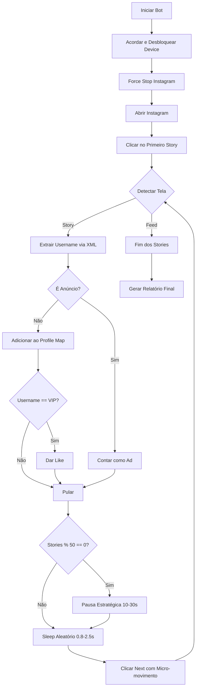

# 📱 Instagram Stories Bot - Documentação Completa

## 🎯 Visão Geral

Sistema automatizado de visualização e interação com Stories do Instagram, desenvolvido para Android via ADB (Android Debug Bridge) e scrcpy. O projeto consiste em dois componentes principais: um bot CLI e uma interface gráfica moderna.

---

## 📂 Estrutura do Projeto

```
/home/thierry/
├── insta_bot.py          # Bot CLI (Command Line Interface)
├── insta_bot_gui.py      # Interface Gráfica (GUI)
├── insta_bot_gui.py.old  # Versões anteriores (backup)
└── INSTAGRAM_BOT_README.md
```

---

## 🤖 Componentes do Sistema

### 1. **insta_bot.py** - Bot CLI

Script principal que automatiza a navegação pelos Stories do Instagram.

#### Funcionalidades:
- ✅ **Navegação automática** entre stories
- ✅ **Detecção de anúncios** vs conteúdo orgânico
- ✅ **Sistema de likes VIP** - curte automaticamente stories de perfil específico
- ✅ **Rate limiting inteligente** - pausas estratégicas a cada 50 stories
- ✅ **Timing humanizado** - variação aleatória (0.8-2.5s) entre ações
- ✅ **Micro-movimentos** - taps com variação de ±5px para simular comportamento humano
- ✅ **Análise em tempo real** via XML parsing (UIAutomator)
- ✅ **Relatório completo** ao final da sessão

#### Métricas Coletadas:
- Total de stories visualizados
- Quantidade de anúncios
- Conteúdo orgânico
- Likes dados
- Perfis únicos
- Tempo de sessão
- Velocidade (stories/min)
- Economia de tempo vs humano
- Ranking de "flooders" (quem posta mais)

### 2. **insta_bot_gui.py** - Interface Gráfica

GUI profissional desenvolvida com PyQt5 e matplotlib para controle e monitoramento visual do bot.

#### Funcionalidades:
- ⚙️ **Painel de Configurações:**
  - Perfil VIP para likes automáticos
  - Coordenadas Story (X, Y)
  - Coordenadas Next (X, Y)
  - Coordenadas Heart/Like (X, Y)

- 🎮 **Controles:**
  - Botão INICIAR BOT
  - Botão PARAR
  - Barra de progresso animada

- 📊 **Dashboard em Tempo Real:**
  - Cards coloridos com métricas
  - Monitor estilo terminal com dados ao vivo
  - Log de atividade colorido

- 📈 **3 Gráficos Interativos:**
  1. **Ads vs Conteúdo** (Gráfico Pizza)
  2. **Top 5 Flooders** (Barras Horizontais)
  3. **Métricas de Performance** (Barras Verticais)

#### Design Moderno:
- Paleta de cores: Roxo (#6c5ce7), Azul (#0984e3), Rosa (#e84393), Verde (#00b894)
- Gradientes em todos os componentes
- Bordas arredondadas (8-10px)
- Efeitos hover e focus
- Layout responsivo (2 colunas)
- Tema dark profissional

---

## 🛠️ Tecnologias Utilizadas

### **Backend / Automação**
| Tecnologia | Versão | Uso |
|------------|--------|-----|
| **Python** | 3.8.10 | Linguagem principal |
| **ADB** (Android Debug Bridge) | - | Comunicação com dispositivo Android |
| **scrcpy** | - | Espelhamento de tela (opcional) |
| **subprocess** | stdlib | Execução de comandos ADB |
| **xml.etree.ElementTree** | stdlib | Parsing de UI XML do Android |

### **Frontend / GUI**
| Tecnologia | Versão | Uso |
|------------|--------|-----|
| **PyQt5** | 5.14.1 | Framework GUI |
| **matplotlib** | 3.7.5 | Visualização de dados e gráficos |
| **QThread** | PyQt5 | Threading para não travar GUI |
| **QSignals** | PyQt5 | Comunicação thread-safe |

### **Outras Bibliotecas**
```python
import os           # Comandos do sistema
import time         # Delays e timing
import random       # Randomização humanizada
import sys          # Sistema e argumentos
from datetime import timedelta  # Formatação de tempo
```

---

## 🔧 Configurações Importantes

### Coordenadas (ajuste conforme resolução do dispositivo):
```python
STORY_X = 745      # X para clicar no primeiro story
STORY_Y = 400      # Y para clicar no primeiro story
NEXT_X = 980       # X para próximo story
NEXT_Y = 1000      # Y para próximo story
HEART_X = 950      # X do botão de like
HEART_Y = 2150     # Y do botão de like
```

### Perfil VIP:
```python
TARGET_PROFILE = "stealthelook"  # Perfil que receberá likes automáticos
```

### Timing:
```python
HUMAN_AVG_VIEW_TIME = 5.0  # Tempo médio humano por story
view_time = random.uniform(0.8, 2.5)  # Tempo entre stories
pause_time = random.uniform(10, 30)   # Pausa a cada 50 stories
```

---

## 🚀 Como Usar

### **Pré-requisitos:**
1. Dispositivo Android com USB Debugging ativado
2. ADB instalado e configurado no PATH
3. Python 3.8+ instalado
4. Dependências Python instaladas:
```bash
pip3 install PyQt5 matplotlib
```

### **Executar Bot CLI:**
```bash
python3 insta_bot.py
```

### **Executar Interface Gráfica:**
```bash
python3 insta_bot_gui.py
```

### **Criar Executável (.AppImage):**
```bash
pip3 install pyinstaller
pyinstaller --onefile --windowed --name "InstagramBot" insta_bot_gui.py
```
O executável ficará em `dist/InstagramBot`

---

## 🧠 Algoritmo de Funcionamento

### **Fluxo de Execução:**



### **Detecção de Tela:**
1. Dump XML da UI via `adb shell uiautomator dump`
2. Parse do XML para encontrar:
   - `resource-id="reel_viewer_title"` (username)
   - `text="Patrocinado"` ou `"Sponsored"` (anúncios)
   - `resource-id="tab_bar"` (voltou ao feed)

### **Sistema de Likes:**
1. **Tentativa 1:** Busca botão via XML por `resource-id="toolbar_like_button"`
2. **Fallback:** Usa coordenadas fixas (HEART_X, HEART_Y)
3. Adiciona micro-movimento (±5px) para naturalidade

---

## 📊 Relatório de Inteligência

### **Exemplo de Output:**

```
╔══════════════════════════════════════════════════════════╗
║           📊 RELATÓRIO DE INTELIGÊNCIA & INSIGHTS        ║
╠══════════════════════════════════════════════════════════╣
║ ⏱️  Duração da Sessão:   0:15:32
║ ⚡  Velocidade do Bot:   12.4 stories/min
║ 💎  Tempo Economizado:   0:29:28 (vs Humano)
╠══════════════════════════════════════════════════════════╣
║ 🎯 AÇÃO DO ROBÔ                                          ║
║    Stories Vistos:       193
║    Conteúdo Real:        165
║    Anúncios:             28
║    Likes Dados:          12
║    Perfis Únicos:        87
╠══════════════════════════════════════════════════════════╣
║ ⚖️  ECONOMIA DA ATENÇÃO (Ads vs Conteúdo)                 ║
║  Conteúdo (165): ███████████████░ 85.5%
║  Anúncios (28):  ██░░░░░░░░░░░░░░ 14.5%
║  👉 Instagram mostra 1 anúncio a cada 5 stories.
╠══════════════════════════════════════════════════════════╣
║ 🏆  RANKING DE FLOODERS (Quem posta mais?)               ║
║  1. @fulano            8 stories ■■■■░░░░░░
║  2. @sicrano           7 stories ■■■░░░░░░░
║  3. @beltrano          6 stories ■■■░░░░░░░
╚══════════════════════════════════════════════════════════╝
```

---

## 🔒 Recursos de Segurança Anti-Detecção

### **1. Timing Humanizado:**
- ❌ **Antes:** Sleep fixo (0.5s)
- ✅ **Agora:** `random.uniform(0.8, 2.5)` segundos

### **2. Micro-movimentos:**
- ❌ **Antes:** Tap sempre em (980, 1000)
- ✅ **Agora:** Tap em (980±5, 1000±5) pixels

### **3. Rate Limiting:**
- Pausa de 10-30s aleatória a cada 50 stories
- Previne detecção por velocidade anormal

### **4. Error Handling Robusto:**
- Tratamento específico de `ParseError`, `TimeoutExpired`
- Fallbacks para comandos ADB falhados
- Nunca trava em erro silencioso

### **5. Substituição de Deprecated:**
- ❌ `os.popen()` → ✅ `subprocess.run()`
- Timeout de 5s em comandos ADB
- Melhor controle de processos

---

## ⚠️ Limitações e Considerações

### **Dependências de Resolução:**
- Coordenadas hardcoded funcionam apenas para resolução específica
- Requer calibração manual para cada dispositivo

### **Detecção pelo Instagram:**
- Uso prolongado pode ser detectado
- Recomendado: Sessões curtas (< 200 stories)
- Evitar uso 24/7

### **Requisitos de Hardware:**
- Dispositivo Android físico ou emulador
- Cabo USB ou conexão ADB wireless
- Python 3.8+ no sistema host

---

## 🎨 Interface Gráfica - Detalhes Técnicos

### **Arquitetura:**
```
MainWindow (QMainWindow)
├── Left Panel (1/3 width)
│   ├── Configurações (QGroupBox)
│   ├── Controles (Botões)
│   ├── Estatísticas (4 Cards)
│   ├── Progress Bar
│   └── Log de Atividade (QTextEdit)
└── Right Panel (2/3 width)
    ├── Monitor em Tempo Real (QTextEdit) [50% height]
    └── Gráficos (QTabWidget) [50% height]
        ├── Tab 1: Pizza Chart
        ├── Tab 2: Horizontal Bar Chart
        └── Tab 3: Vertical Bar Chart
```

### **Threading Model:**
```python
BotWorker(QThread)  # Thread separada para bot
    ├── log_signal → GUI log
    ├── progress_signal → GUI stats + graphs
    └── finished_signal → Final report
```

### **Signals Utilizados:**
- `pyqtSignal(str, str)` - Log com tipo (info/warning/error)
- `pyqtSignal(dict)` - Dados em tempo real
- `pyqtSignal(dict)` - Relatório final

---

## 📈 Melhorias Futuras (Roadmap)

- [ ] Auto-calibração de coordenadas via Computer Vision
- [ ] Suporte multi-dispositivo simultâneo
- [ ] Exportar relatórios em PDF/CSV
- [ ] Machine Learning para detecção de conteúdo
- [ ] Histórico de sessões com banco de dados
- [ ] Modo headless (sem GUI do scrcpy)
- [ ] Configuração via arquivo JSON/YAML
- [ ] Detecção automática de Captcha
- [ ] Integração com Selenium para web Instagram

---

## 📝 Changelog

### **v2.0** (Atual - GUI Moderna)
- ✅ Interface gráfica completa com PyQt5
- ✅ 3 gráficos interativos (matplotlib)
- ✅ Monitor em tempo real estilo terminal
- ✅ Design moderno com gradientes e animações
- ✅ Layout responsivo 2 colunas
- ✅ Threading para não travar GUI

### **v1.5** (Melhorias de Segurança)
- ✅ Timing humanizado aleatório
- ✅ Micro-movimentos nos taps
- ✅ Rate limiting a cada 50 stories
- ✅ Substituição de `os.popen()` por `subprocess.run()`
- ✅ Error handling robusto

### **v1.0** (Versão Inicial)
- ✅ Bot CLI funcional
- ✅ Detecção de anúncios
- ✅ Sistema de likes VIP
- ✅ Relatório final completo

---

## 🤝 Contribuições

Este projeto foi desenvolvido como ferramenta de automação pessoal. Modificações e melhorias são bem-vindas!

### **Como contribuir:**
1. Fork o projeto
2. Crie uma branch (`git checkout -b feature/nova-funcionalidade`)
3. Commit suas mudanças (`git commit -am 'Adiciona nova funcionalidade'`)
4. Push para a branch (`git push origin feature/nova-funcionalidade`)
5. Abra um Pull Request

---

## ⚖️ Aviso Legal

Este bot foi criado para fins educacionais e de automação pessoal. O uso deste software deve respeitar os Termos de Serviço do Instagram. O desenvolvedor não se responsabiliza por:

- Banimentos de conta
- Violações de ToS
- Uso indevido da ferramenta
- Problemas legais decorrentes do uso

**Use por sua conta e risco! ⚠️**

---

## 📧 Suporte

Para dúvidas, problemas ou sugestões:
- Verifique os logs de erro no terminal
- Calibre as coordenadas para seu dispositivo
- Teste com sessões curtas primeiro
- Monitore o comportamento do bot via scrcpy

---

## 🏆 Créditos

**Desenvolvido por:** Thierry  
**Data:** Janeiro 2026  
**Tecnologias:** Python, PyQt5, matplotlib, ADB, Android UIAutomator  
**Licença:** Uso Pessoal

---

**🎯 Enjoy automating responsibly!** 🤖✨
